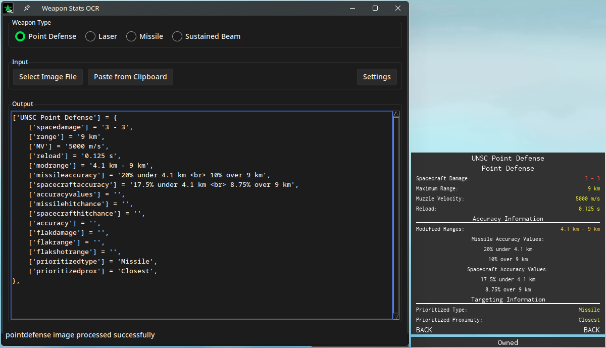

# Project Stardust statcard OCR

Simple OCR processing to read the statcards of weapons for the game Project Stardust using pytesseract and regex.



## Getting Started


### Dependencies

* Python
    * Pillow
    * pytesseract
    * beautifulsoup4
    * requests
    * numpy
    * pandas
    * tkinter
    * pytest
    * sphinx
* [Tesseract OCR](https://github.com/tesseract-ocr/tesseract)
  

### Installing

Download all files by clicking the green "<> Code" button and selecting "Download ZIP"

Install the needed modules with
```bash
pip install -r requirements.txt
```

Tesseract can be installed with any package manager on Linux. For MacOS it may require [Homebrew](https://formulae.brew.sh/formula/tesseract). For Windows, you will need to use the installers by [UB Mannheim](https://github.com/UB-Mannheim/tesseract/wiki).

### Executing program

Start the script with
```bash
python main.py
```

  

## Credits

Erb

Rdbende for Sun Valley theme

Tesseract for their OCR


## See Also

* [Game](https://www.roblox.com/games/2394257515/Project-Stardust)

* [Wiki](https://projectstardustwiki.miraheze.org/wiki/Main_Page)

* [Tesseract](https://github.com/tesseract-ocr/tesseract)

* [Sun Valley Theme](https://github.com/rdbende/Sun-Valley-ttk-theme)
